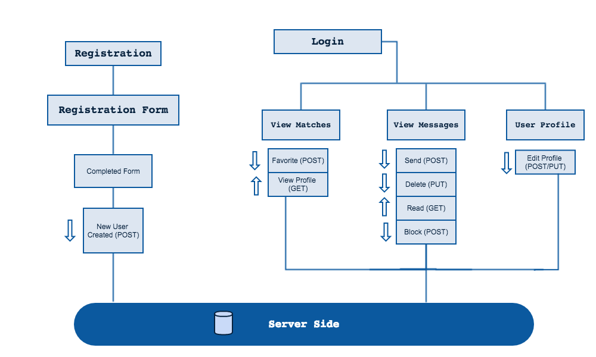
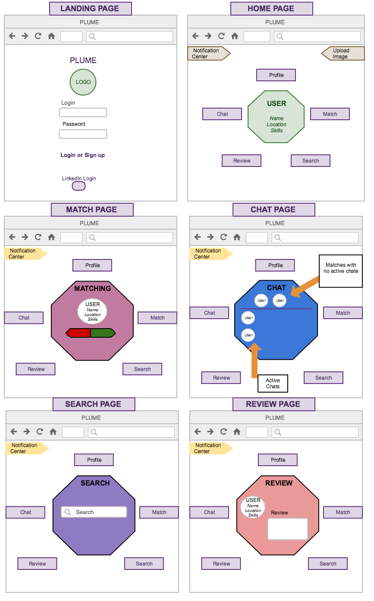

## Plume

**Plume** is a social skill sharing application that allows users to match and connect with others who possess a skill that they are interested in. Users are able to browse a deck of potential skill matches, and can choose to interact with them by liking their profiles.

Once both users "like" each other, they can begin to message and arrange the terms of their skill exchange.

## Tech/framework used

**Built with**

- React
- React-Router
- Express
- MongoDB
- Node.js
- Bootstrap

## Motivation & Features

Ever had an idea for a project, but didn't know where to start because you lacked a specfic skillset?

Enter Plume.

We want to create a simple way for creatives to connect with and meet others with skills and expertise  that they may need for the project idea or business that they're trying to get started.

## Data Flow

## MVP

- Collect generic user info through ‘signup’ and save it to database.
- Generate user objects for every new user that saves data (name, email, skill, etc.)
- Generate arrays and sort through them to then display reciprocal data to matching users.
- Enable email exchange between users once they match.

## UI Wireframes

## Code Example

To be added.

## Screenshots

To be added.

## Installation

To be added.

## API Reference

To be added.

## Tests

## How to use?

To be added.

## Credits

Built by Li Chien, Amber Runge, Maria Seneca, Taqwa Rushdan, and Dan Yee.

Full Stack Web Development students at George Washington University.

## License

To be added.
